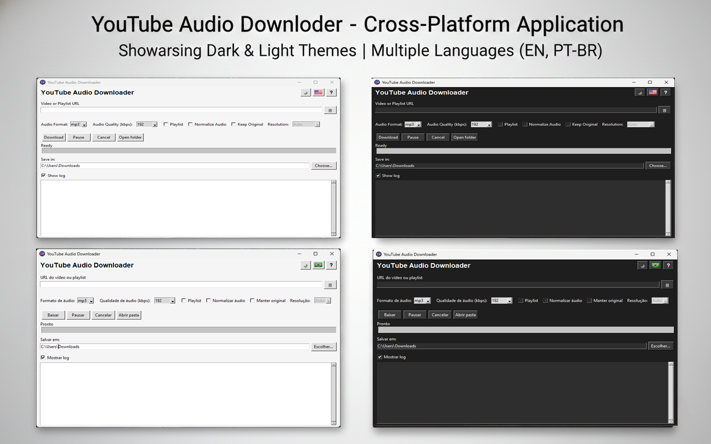

# 🎵 YouTube Audio Downloader

A **professional desktop application** for downloading **audio from YouTube videos and playlists**, with optional video preservation, built with **Python, Tkinter, yt-dlp, and FFmpeg**.

Designed with **clean architecture**, **clear separation of concerns**, and **production-grade UX**, this project focuses on reliability, transparency, and full local control.

---

## 📘 Table of Contents

- [🎵 YouTube Audio Downloader](#-youtube-audio-downloader)
  - [📘 Table of Contents](#-table-of-contents)
  - [🔥 Overview](#-overview)
  - [🖼️ Screenshot](#-screenshot)
  - [⚡ Main Features](#-main-features)
  - [🚀 Quick Usage Guide](#-quick-usage-guide)
  - [📝 Important Notes](#-important-notes)
  - [🏗 Project Architecture](#-project-architecture)
  - [🛠 Technologies](#-technologies)
  - [💻 Installation](#-installation)
  - [⚙ Configuration](#-configuration)
  - [▶ Running the Application](#-running-the-application)
  - [📂 Directory Structure](#-directory-structure)
  - [📜 License](#-license)
  - [👤 Author](#-author)
  - [💬 Feedback](#-feedback)

---

## 🔥 Overview

**YouTube Audio Downloader** is a **fully local desktop application** designed to download audio from YouTube videos and playlists while offering:

✔ Fine-grained control over audio format  
✔ Optional preservation of the original video file  
✔ Playlist support with manual item selection  
✔ Clean and intuitive workflow  
✔ No cloud processing — everything runs locally  

This project prioritizes **clarity, safety, and control**, making it suitable for both casual users and power users.

---

## 🖼️ Screenshot



---

## ⚡ Main Features

- ✔ Download audio from YouTube videos (MP3 and other formats)
- ✔ Optional preservation of the original video file
- ✔ Video resolution selection when keeping the original file
- ✔ Playlist support with manual item selection
- ✔ Pause, resume, and cancel downloads at any time
- ✔ Fully local application (no cloud services involved)
- ✔ Language and theme support
- ✔ Safe file handling and normalization checks

---

## 🚀 Quick Usage Guide

1. Paste a **YouTube video or playlist URL**
2. Select the desired **audio format** (MP3 is default)
3. *(Optional)* Enable **Keep Original** to also download the video
4. If enabled, choose the preferred **video resolution** (Auto by default)
5. Choose the **destination folder**
6. Click **Download** and monitor progress

---

## 📝 Important Notes

- • An **internet connection** is required to download content from YouTube
- • When **Keep Original** is disabled, only audio is downloaded
- • Resolution selection applies **only** when keeping the original video
- • **Auto resolution** downloads the best available quality per video
- • Some videos may have **age, region, or access restrictions**
- • Playlist downloads allow **manual selection** of videos
- • Some configuration changes (like language) require restarting the app

---

## 🏗 Project Architecture

```
UI (Tkinter)
 └── AppWindow
      ├── Download Controller
      ├── Playlist Selection Modal
      ├── Internationalization (i18n)
      ├── Theme Manager
      └── Core Download Logic (yt-dlp + FFmpeg)
```

The architecture is designed to be:

- Modular
- Testable
- Easy to extend
- Easy to maintain

---

## 🛠 Technologies

- Python 3.10+
- Tkinter
- yt-dlp
- FFmpeg
- Mutagen (audio metadata)
- JSON-based configuration

---

## 💻 Installation

```bash
git clone https://github.com/CelmarPA/YouTube-Audio-Downloader
cd YouTube-Audio-Downloader
python -m venv venv
source venv/bin/activate  # Windows: venv\Scripts\activate
pip install -r requirements.txt
```

---

## ⚙ Configuration

All user preferences are stored locally in a JSON configuration file.

Some settings (like language) require restarting the application to take effect.

FFmpeg is expected to be bundled with the application or available in the system path.

---

## ▶ Running the Application

```bash
python main.py
```

---

## 📂 Directory Structure

```
YouTube-Audio-Downloader/
│
├── assets/
│   ├── br_icon.png
│   ├── icon.ico
│   ├── icon.png
│   └── us_icon.png
│
├── bin/
│   ├── ffmpeg.exe
│   ├── ffplay.exe
│   └── ffprobe.exe
│
├── config/
│   └── app_config.json
│
├── controller/
│   └── download_controller.py
│
├── core/
│   ├── audio.py
│   ├── downloader.py
│   └── ydl_logger.py
│
├── docs/
│   └── screenshot.png
│
├── download_state/
│
├── i18n/
│   ├── en_US.py
│   ├── manager.py
│   └── pt_BR.py
│
├── ui/
│   ├── dialogs/
│   │   └── themed_messagebox.py
│   ├── app_window.py
│   ├── help_window.py
│   ├── playlist_frame.py
│   └── tooltip.py
│
├── utils/
│   ├── app_config.py
│   ├── audio_tags.py
│   ├── helpers.py
│   ├── network.py
│   ├── paths.py
│   ├── sanitize.py
│   └── window.py
│
├── widgets/
│   └── folders.py
│
├── main.py
├── requirements.txt
└── README.md
```

---

## 📜 License

This project is open-source and licensed under the **MIT License**.

You are free to use, modify, and distribute it for personal or educational purposes.

---

## 👤 Author

**Celmar Pereira de Andrade** 

- GitHub: https://github.com/CelmarPA
- Project: https://github.com/CelmarPA/YouTube-Audio-Downloader
- [LinkedIn](https://www.linkedin.com/in/celmar-pereira-de-andrade/)

---

## 💬 Feedback

Enjoy the app and feel free to suggest improvements or open issues!
